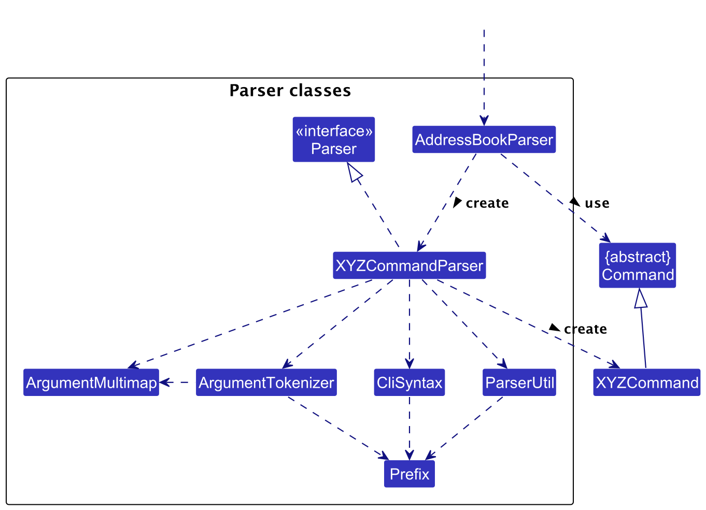
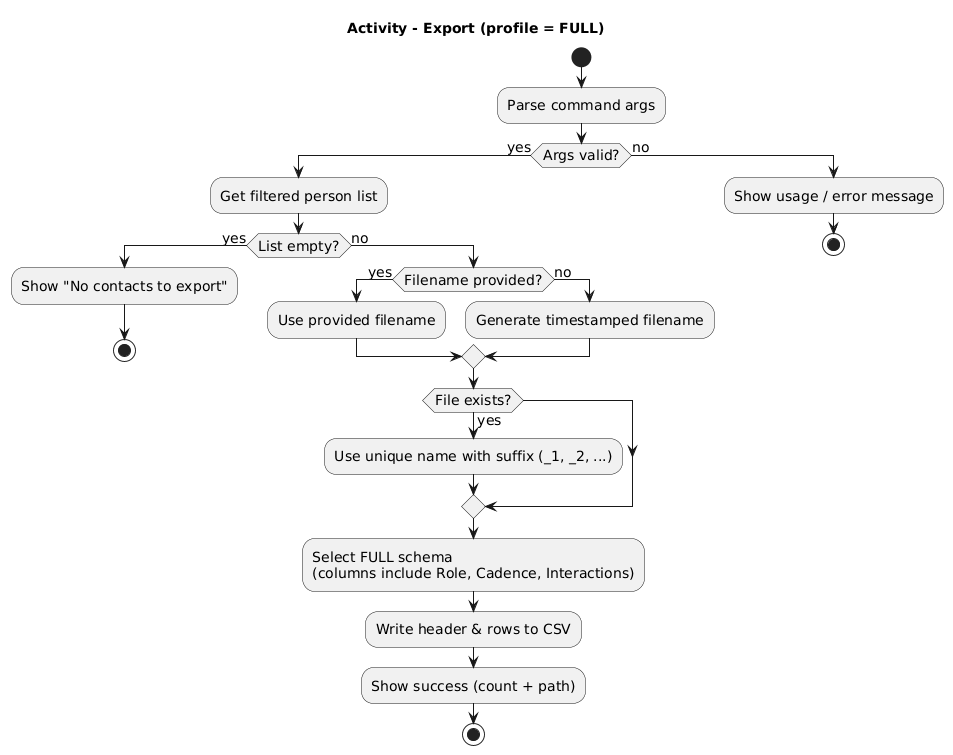
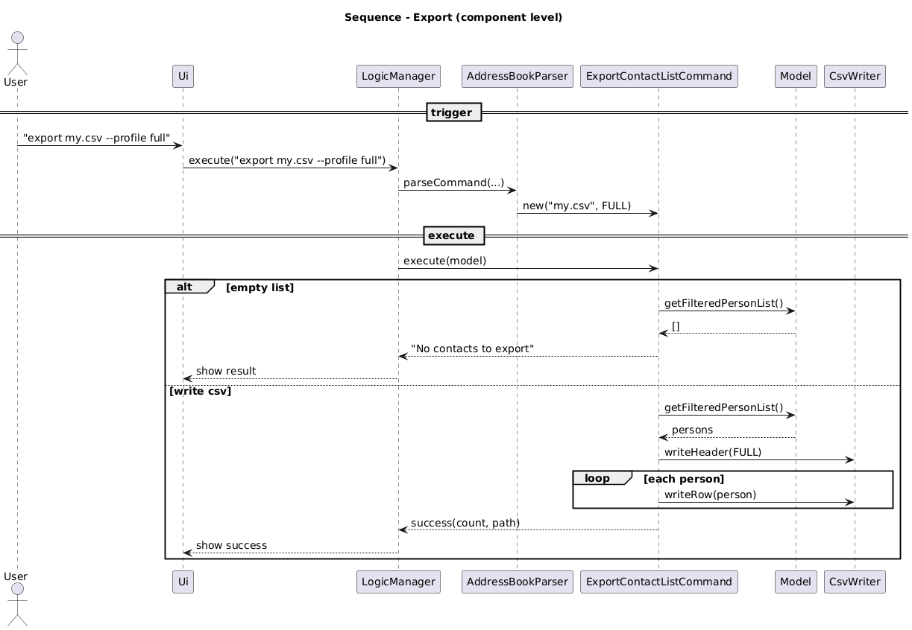
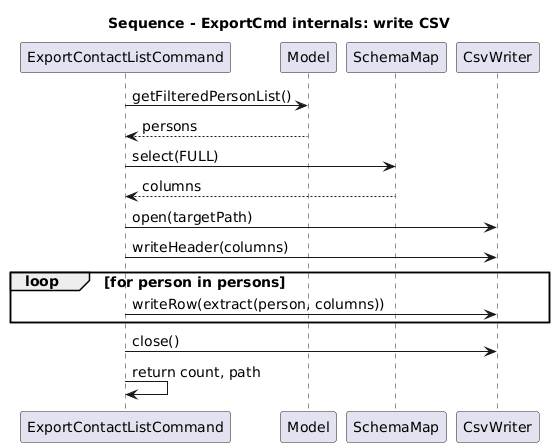
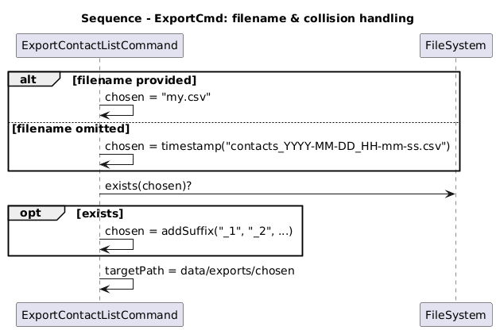
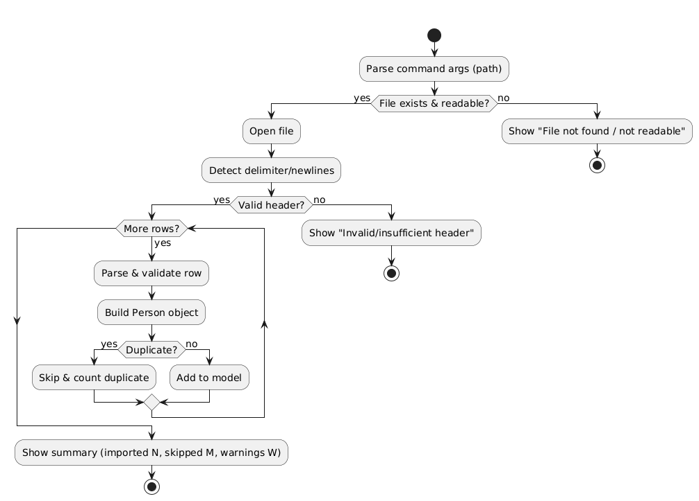
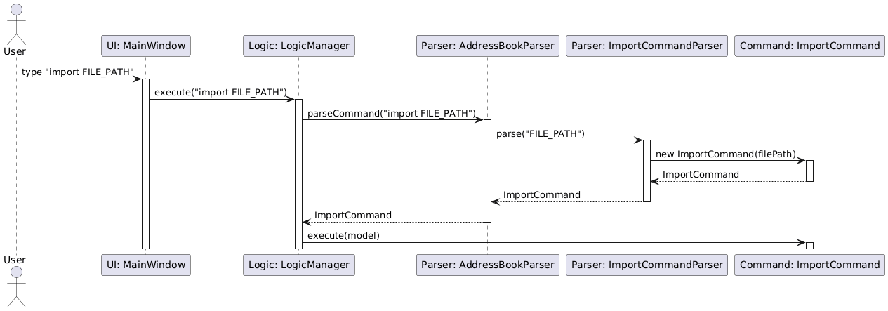
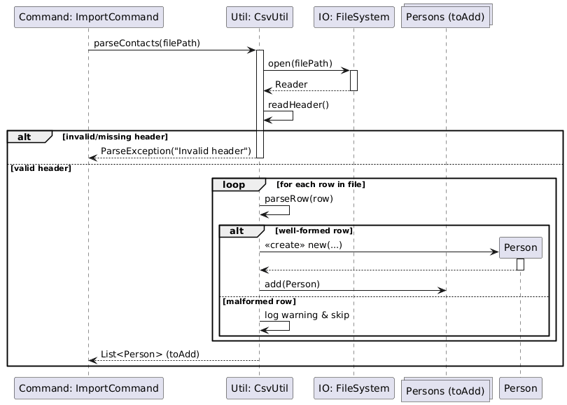

* Table of Contents
  {:toc}

--------------------------------------------------------------------------------------------------------------------

This guide helps new developers understand how MeshCRM works inside.  
It explains the main design ideas and how each part connects together.

## Acknowledgements

MeshCRM is adapted from [SE-EDU AddressBook-Level3 (AB3)](https://github.com/se-edu/addressbook-level3).
We retain AB3’s architecture (UI/Logic/Model/Storage), testing/CI scaffolding (Gradle, JUnit, GitHub Actions), and
portions of its documentation structure (UG/DG).
CSV import/export is implemented in-house (`CsvUtil`) while JSON persistence continues to use Jackson.

--------------------------------------------------------------------------------------------------------------------

## Setting up, getting started

Follow AB3’s **SettingUp** instructions (JDK 17, JavaFX, Gradle) and this repo’s `README`.
Run `gradlew clean test` to verify the build; `gradlew run` launches the app.
On first run, the app creates the `data/` folder and an initial JSON storage file.

### Development conventions

All new commands, parsers, and models should follow the AB3 class structure.  
Each feature should include corresponding unit tests in `src/test/java`.  
Follow the SE-EDU Checkstyle rules before committing.  
Use clear commit messages following the conventional format (`type: summary`).  
All pull requests must pass CI before merge.

--------------------------------------------------------------------------------------------------------------------

## **Design**

:bulb: **Tip:** The `.puml` files used to create diagrams are in this document’s `docs/diagrams` folder. Refer to the [
_PlantUML Tutorial_ at se-edu/guides](https://se-education.org/guides/tutorials/plantUml.html) to learn how to create
and edit diagrams.

### Architecture

The ***Architecture Diagram*** above explains the high-level design of the app.

**Changes to Architecture since AB3:**
* **Storage now also persists `CommandHistory`** (JSON at `data/commandhistory.json`) during app shutdown.
* **CSV Import/Export** uses `model.util.CsvUtil` for parsing/writing; persistent storage remains Jackson JSON.

**What MeshCRM changes vs AB3 (at a glance)**

- **Domain extensions** to `Person`: `Role` (Investor/Partner/Customer/Lead), optional `Cadence` (follow-up interval in
  days), and an immutable list of `Interaction` (type, details, timestamp).
- **New commands**: `log` (append an interaction), `sortfollowup` (sort by follow-up priority), `import` / `export` (
  CSV).
- **UI details panel** shows Role, Cadence, derived **Next follow-up** date, and an **Interactions** list.
- AB3 features like `list`, `exit`, `undo`, `find` remain with clarified semantics where applicable.

Given below is a quick overview of the main components and how they interact.

**Main components of the architecture**

**`Main`** (classes `Main` and `MainApp`) launches and shuts down the app.

* At launch, it initializes components and wires them together.
* At shutdown, it closes components and persists user data.

The bulk of the work is done by the following four components:

* [**`UI`**](#ui-component): JavaFX interface (views, panels, FXML).
* [**`Logic`**](#logic-component): Parses user input and executes commands.
* [**`Model`**](#model-component): In-memory state of contacts and user prefs.
* [**`Storage`**](#storage-component): Persists data (JSON) and provides CSV utilities (non-persistent).

[**`Commons`**](#common-classes) contains utilities shared across components.

**How the architecture components interact**

The *Sequence Diagram* below shows a typical flow for a mutating command (`delete 1`): UI → Logic (parse) → Command → Model (mutate/query) → Storage/UI.

Each component exposes an interface (`{Component}.java`) and a concrete manager (`{Component}Manager`). Other components
depend on the interface, not the concrete class, to reduce coupling.

The sections below detail each component.

### UI component

The **API** of this component is specified in `Ui.java`.

The UI uses JavaFX. `MainWindow` composes `CommandBox`, `ResultDisplay`, `PersonListPanel`, `StatusBarFooter`, and a *
*`PersonDetailsPanel`** extended for MeshCRM to render:

- **Role** (Investor/Partner/Customer/Lead),
- **Cadence** (e.g., “30 days”),
- **Next follow-up** (derived date shown as `yyyy-MM-dd`),
- **Interactions** (list with timestamp, type, and details).

Layouts are defined in matching `.fxml` files under `src/main/resources/view/`.

The UI:

* delegates command execution to the `Logic` component,
* listens to observable `Model` lists to auto-refresh panels,
* depends on model classes it renders (e.g., `Person`, `Interaction`).

### Logic component

**API** : `Logic.java`

:information_source: **Note:** The lifeline for `DeleteCommandParser` should end at the destroy marker (X) but due to a PlantUML limitation, it continues till the end.

How it works:

1. `LogicManager#execute(String)` delegates to `AddressBookParser` which instantiates the appropriate
   `XYZCommandParser` (e.g., `LogCommandParser`) to parse user input.
2. The specific `Command` executes and may interact with the `Model`.
3. `CommandResult` returns user-visible feedback and optional UI flags (e.g., exit).

MeshCRM adds parsers/commands for:

- `LogCommand` (`log INDEX i/TYPE d/DETAILS`)
- `SortFollowUpCommand` (`sortfollowup`)
- `ImportContactListCommand`/`ExportContactListCommand` (`import`, `export`)

Other parsing helpers follow AB3 conventions.

### Model component

**API** : `Model.java`

The `Model` stores:

* the address book data — `UniquePersonList` of `Person`,
* a filtered, unmodifiable `ObservableList<Person>` that the UI binds to,
* `UserPref` with GUI settings and file paths.

**MeshCRM domain extensions**

- `Person` now includes:
    - `Role role` (required, validated set),
    - `Cadence cadence` (optional; positive days),
    - immutable `List<Interaction>` (timestamped records).
- `Interaction` = `(InteractionType type, String details, Instant timestamp)`.
  Rendered as `yyyy-MM-dd HH:mm` in the interactions list.
- `InteractionType` is an enum (e.g., `CALL`, `EMAIL`, `MEETING`, `NOTE`).
- Convenience methods: e.g., `getLastInteractionOrNull()` and safe, immutable accessors.

:information_source: **Note:** The alternative tag-pooling model in AB3 remains applicable; MeshCRM keeps AB3’s approach for tags.

### Storage component

**API** : `Storage.java`

The `Storage` component:

* saves/loads the address book and user prefs as JSON (Jackson),
* includes JSON adapters for new fields (`Role`, `Interaction`, lists of `Interaction`),
* provides CSV utilities for **import/export** (non-persistent helper separate from JSON persistence).

### Common classes

Shared utilities (e.g., `LogsCenter`, `StringUtil`, exceptions) live in `seedu.address.commons`.

--------------------------------------------------------------------------------------------------------------------

## **Implementation**

This section highlights noteworthy MeshCRM implementations. (Diagrams remain as in AB3.)

### `log` — Append an interaction to a contact

**Command format**: `log INDEX i/TYPE d/DETAILS`
Examples:

- `log 1 i/email d/Sent pricing deck`
- `log 2 i/meeting d/Quarterly review at client HQ`

**Parser**: `LogCommandParser` validates:

- index is a positive integer,
- `i/` is a valid `InteractionType` (case-insensitive),
- `d/` is non-empty and within length limits.

**Execution**: `LogCommand#execute`

- clones the contact’s interactions, appends a new `Interaction(type, details, Instant.now())`,
- creates a new `Person` instance (immutability),
- updates the model and returns a success `CommandResult`.

**Rationale**:

- Immutability avoids shared-state bugs in the UI and storage layers.
- Timestamp source in the command (vs UI) simplifies testing and keeps a single time-of-truth.

### `sortfollowup` — Sort by follow-up priority

**Command format**: `sortfollowup`

**Current behavior**:

- Sorts contacts primarily by **next follow up date** (more recent first).
- Contacts with no interactions are placed last.

**Rationale**:

- Comparator isolated under model logic so UI stays passive.
- Clear tie-breaks make ordering deterministic.

### CSV `export`

<!-- Sequence diagrams split for readability -->

*UI → Logic → Parser → ExportCommand → Model → CsvUtil/FileWriter; alt paths for empty list, filename omitted, collision.*
**Export format**: `export [filename].csv`

**Command**  
`export [FILENAME].csv [--profile standard|full]`
- **Output folder:** `data/exports/` (auto-created)
- **Profiles:**
    - `standard` (default): Name, Phone, Email, Address, Tags
    - `full`: + Role, Cadence, Interactions
- **Filename rules:**
    - If **omitted** → timestamped (e.g., `contacts_YYYY-MM-DD_HH-mm-ss.csv`)
    - If **exists** → numeric suffix (`_1`, `_2`, …)

**Behavior**
- Exports the **currently displayed list** (respects active filters).
- Proper CSV quoting for commas, quotes, and newlines; UTF-8; `;` joins multiple tags inside one cell.
- **Edge cases:** empty list → “No contacts to export”; invalid path/permissions → clear error.

**Pseudocode**
- if filtered.isEmpty(): return "No contacts to export"
- name = givenName or timestamp()
- path = uniquePath("data/exports/", name)
- cols = (profile == FULL ? FULL_COLUMNS : STD_COLUMNS)
- writeHeader(cols); for p in filtered: writeRow(extract(p, cols))
- return "Exported N contacts to " + path

**Quick manual tests**
- Basic: `export my.csv` → file at `data/exports/my.csv` with expected columns
- Filtered view → only filtered rows exported
- Omit filename → timestamped file
- Collision → `_1` suffix
- Fields with commas/newlines open correctly in spreadsheet apps

### CSV `import`

**Sequence Diagrams**
**Part 1: Command invocation & parsing**

**Part 2: File parsing, validation & model update**

**Command**  
`import PATH/TO/file.csv`

**Behavior**
- **Header-based** parsing (tolerant to column order); delimiter/newlines auto-detected when possible.
- Per row: parse → validate → build `Person`; **duplicates** (per `Person#equals`) are **skipped**.
- Continues on malformed lines; shows a **summary**: imported N, skipped (duplicates) M, malformed W.

**Edge cases**
- File not found / unreadable → clear error with given path.
- Invalid/missing required header → error and abort.
- Non-UTF-8 or mixed quoting → affected lines counted as malformed.

**Quick manual tests**
- Basic import with valid header → contacts added; summary shown
- Missing file → error message with path
- CSV with a few malformed and duplicate rows → imports valid rows; summary reports counts

**Rationale**:

- CSV provides quick interoperability with spreadsheets/other CRMs,
- Import is tolerant by design to maximize utility in early project stages.

### Command History

**Command format**: <kbd>↑</kbd> and <kbd>↓</kbd> keys

- <kbd>↓</kbd> toggles to later commands
- <kbd>↑</kbd> toggles to earlier commands

**Rationale**:

- Maintaining a command history allows quick navigability to earlier commands
- Implementing this feature also ties in with the Undo feature
- How it works:
  1. The MainWindow class listens for UP or DOWN key presses
  2. Depending on which is pressed, getNext or getPrevious will be called by Logic
  3. With the command, the commandHistory component will be called
  4. The key press event is then consumed within MainWindow

### Undo/redo (AB3-proposed; unchanged)

MeshCRM inherits AB3’s **proposed** design using `VersionedAddressBook` (commit/undo/redo). See AB3 diagrams and notes
for details; our commands call `commit` on successful mutations.

### Data archiving (proposed)

Future work could rotate or snapshot JSON data for long-term audit of interactions.

--------------------------------------------------------------------------------------------------------------------

## **Documentation, logging, testing, configuration, dev-ops**

* [Documentation guide](Documentation.md)
* [Testing guide](Testing.md)
* [Logging guide](Logging.md)
* [Configuration guide](Configuration.md)
* [DevOps guide](DevOps.md)

Notes for MeshCRM:

- Extend parser/command tests for `log`, `sortfollowup`, `import`, `export`.
- UI tests (FXML) for `PersonDetailsPanel` fields: Role, Cadence, Next follow-up, Interactions list.
- Storage tests for JSON adapters that include interactions.

--------------------------------------------------------------------------------------------------------------------

## **Appendix: Requirements**

### Product scope

**Target user profile**:

* individual founders/early sales teams who track many contacts,
* prefer fast keyboard workflows (CLI-first),
* want lightweight CRM features (logging interactions, follow-up cadence) without SaaS overhead.

**Value proposition**: manage contacts **and** follow-ups faster than typical mouse/GUI-driven apps; keep a clear
history of interactions.

### User stories

Priorities: High (must have) - `* * *`, Medium (nice to have) - `* *`, Low (unlikely) - `*`

| Priority | As a …​ | I want to …​ | So that I can…​ |
|---:|---|---|---|
| `* * *` | user | **add** a new contact | store their information in my list |
| `* * *` | user | **update** (edit) a contact's details | keep their information accurate |
| `* * *` | user | **delete** a contact | remove irrelevant or outdated entries |
| `* * *` | user | **list** all my contacts | see everyone in my address book |
| `* * *` | user | **view** a contact's details (phone, email, address) | get the information I need to reach them |
| `* * *` | user | **find** a contact by their partial name | locate them quickly without typing their full name |
| `* * *` | user | **add** a role to my contact | specify their professional position |
| `* * *` | salesperson | **log** a call/email/meeting/note | remember what happened and when |
| `* * *` | salesperson | **view** the history of interactions with a contact | have full context before my next communication |
| `* * *` | salesperson | **sort** by follow-up priority (`sortfollowup`) | decide who to contact next |
| `* * *` | salesperson | **view** a predicted next follow-up date | be reminded of when to reach out |
| `* * *` | user | **import** contacts from CSV | bootstrap my CRM from existing lists |
| `* * *` | user | **export** contacts to CSV | back up/share my data |
| `* *` | user | **assign** multiple tags to a contact | categorize and filter them in flexible ways |
| `* *` | salesperson | **view** statistics based on tags | understand the composition of my contact list |
| `* *` | user | **open** the help window easily | get assistance when I'm stuck |
| `* *` | user | view **Role** and **Cadence** in details | see context at a glance |
| `* *` | user | use `list` to reset filters | return to a full view quickly |
| `*` | user | **add** a role using a shortcut | perform common actions faster |
| `*` | user | hide private contact details | reduce accidental disclosure |

### Use cases

(For all use cases below, the **System** is the `AddressBook` and the **Actor** is the `user`, unless specified
otherwise.)

**Use case: UC-LOG — Log an interaction**

**MSS**

1. User enters `log INDEX i/TYPE d/DETAILS`.
2. System appends a new interaction with the current timestamp to the specified contact.
3. System shows a success message and updates the details panel.

**Extensions**

- 1a. `INDEX` invalid → System shows error; no change.
- 1b. `TYPE` invalid/missing → System shows usage error.
- 1c. `DETAILS` empty/too long → System shows validation error.

**Use case: UC-SORT — Sort by follow-up priority**

**MSS**

1. User enters `sortfollowup`.
2. System sorts the current list using the cadence/interaction comparator and updates the UI.

**Extensions**

- None.

**Use case: UC-EXPORT — Export contacts to CSV**

**MSS**

1. User enters `export [name].csv`.
2. System writes the current (possibly filtered) list to `data/exports/[name].csv`.
3. System reports the file path and count.

**Extensions**

- 1a. No contacts in the current view → System informs “No contacts to export”.
- 1b. I/O error → System reports failure with reason.

**Use case: UC-IMPORT — Import contacts from CSV**

**MSS**

1. User enters `import PATH/TO/file.csv`.
2. System reads rows, creates contacts, skips duplicates, and adds valid entries.
3. System reports counts (imported, skipped, malformed).

**Extensions**

- 1a. File not found → System reports an error with the given path.
- 2a. Malformed lines → System skips and continues; summarizes at the end.

**Use case: UC-LIST — List all contacts**

- `list` resets filters and shows all contacts. Extra text after `list` is ignored.

**Use case: UC-EXIT — Exit the app**

- `exit` closes the app; data is automatically persisted.

### Non-Functional Requirements

1. Works on Windows/macOS/Linux with Java **17+**.
2. Usable UI loads within ~3 seconds on typical laptops; `log`/`sortfollowup` complete within ~200 ms on 5k contacts.
3. JSON writes are atomic; app recovers gracefully from partial/corrupt files where possible.
4. CSV import/export should handle 10k rows within ~5 seconds on SSDs.

### Glossary

* **Cadence**: desired interval (days) between follow-ups with a contact.
* **Interaction**: a timestamped activity (call, email, meeting, note) with free-text details.
* **Next follow-up**: derived date from `last interaction + cadence`.
* **Filtered list**: the subset of contacts currently displayed in the UI.
* **MSS (Main Success Scenario)**:The normal, expected sequence of steps for a use case without errors.
* **CSV (Comma-Separated Values)**: A plain text format for tabular data used for import/export.
* **JSON (JavaScript Object Notation)**: A structured text format used for persistent data storage.
* **UI (User Interface)**: The visible part of the application users interact with (JavaFX in this project).
* **CLI (Command-Line Interface)**: The text-based input system where users type commands.
* **Tag**: A label assigned to contacts for grouping or filtering purposes.
* **Command**: A user-entered instruction (e.g., log, find, sortfollowup) that triggers logic execution.
* **Parser**: Component that interprets user input and constructs the corresponding command object.
* **Model**: In-memory representation of user data (contacts, interactions, preferences).
* **Storage**: Handles reading and writing of data (JSON/CSV) to the filesystem.
* **Undo/Redo Stack**:Mechanism that stores previous versions of the model for history navigation.

--------------------------------------------------------------------------------------------------------------------

## **Appendix: Instructions for manual testing**

Below are starting points for manual testing; testers should extend with exploratory tests.

### Launch and shutdown

1. **Initial launch**
    1. Place the jar in an empty folder.
    2. Double-click the jar.
       **Expected**: GUI shows sample contacts; window size may not be optimal.

2. **Saving window preferences**
    1. Resize/move the window and close it.
    2. Relaunch the jar.
       **Expected**: Last window size and position are retained.

### Listing contacts

1. **List resets filters**
    - Run: `list gibberish`
      **Expected**: Extra text ignored; full list shown.

### Logging interactions

1. **Happy path**
    - Prereq: `list` to ensure multiple contacts visible.
    - Run: `log 1 i/email d/Sent pricing deck`
      **Expected**: Success message; `PersonDetailsPanel` shows a new interaction with timestamp and details.

2. **Invalid index**
    - Run: `log 0 i/call d/Check-in`
      **Expected**: Error about invalid index; no model changes.

3. **Invalid/missing type**
    - Run: `log 1 i/coffee d/Catch-up`
      **Expected**: Error listing valid interaction types.

4. **Empty details**
    - Run: `log 1 i/meeting d/`
      **Expected**: Error that details must not be empty.

### Sorting by follow-up priority

1. **Sort with interactions**
    - Create two contacts and log an interaction on only one.
    - Run: `sortfollowup`
      **Expected**: Contact with the **more recent** last interaction appears earlier (current behavior).

2. **Contacts without interactions**
    - Ensure at least one contact has no interactions.
    - Run: `sortfollowup`
      **Expected**: Contacts without interactions are placed last.

### Exporting to CSV
1. **Basic export**
    - Run: `export mylist.csv`
      **Expected**: `data/exports/mylist.csv` exists; columns `name,phone,email,address,tags`.

2. **Filtered export**
    - Filter the list (e.g., run `find`); then `export filtered.csv`.
      **Expected**: Only currently displayed contacts are exported.

3. **Edge fields**
    - Use contacts with commas/newlines in fields.
      **Expected**: CSV quotes are correct; file opens cleanly in spreadsheet apps.

### Importing from CSV

1. **Basic import**
    - Prepare a CSV with header `name,phone,email,address,tags`.
    - Run: `import data/exports/mylist.csv`
      **Expected**: Contacts added; duplicates skipped; summary shown.

2. **File not found**
    - Run: `import does/not/exist.csv`
      **Expected**: Clear error with the path.

3. **Malformed lines**
    - Intentionally break a line (e.g., missing name).
      **Expected**: Line skipped; summary reports malformed count.

### Saving data

1. **Missing/corrupt JSON**
    - Close the app.
    - Temporarily remove or corrupt the JSON in `data/`.
    - Relaunch.
      **Expected**: App recreates storage or reports recovery guidance without crashing.

--------------------------------------------------------------------------------------------------------------------

## Appendix: Planned Enhancements

**Team size:** 5

---

### 1. Improve Tag Management: Append Tags to Existing Contacts

* **Problem:** Currently, adding new tags to an existing contact requires the user to retype all existing tags when using the `edit` command. This process is inconvenient and error-prone.
* **Planned Enhancement:** We will introduce a new prefix (e.g., `+t/`) for the `edit` command. This will allow users to append new tags to a contact without affecting the existing ones.
* **Example:**
    * **Current:** `edit 1 t/friend t/client` (requires retyping all tags)
    * **Future:** `edit 1 +t/vip` (adds the `vip` tag while keeping `friend` and `client`)

### 2. Expand Search Capability: Find Beyond Name Field

* **Problem:** The current `find` command only searches the contact's name field. This limits the user's ability to locate contacts by other important information, such as their email, role, or associated tags.
* **Planned Enhancement:** The `find` command will be extended to optionally search all relevant fields, including email, phone, role, and tags, in addition to the name.
* **Example:**
    * **Current:** `find amy` (finds contacts *only* with "amy" in the name)
    * **Future:** `find amy` (finds contacts with "amy" in the name, email, role, or tag)
