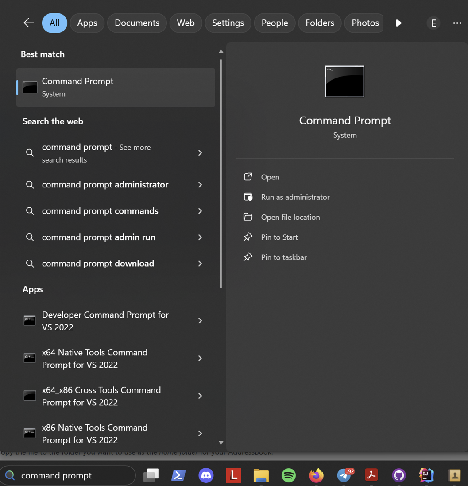
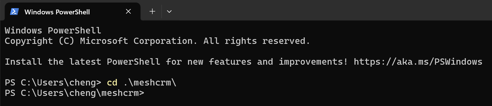
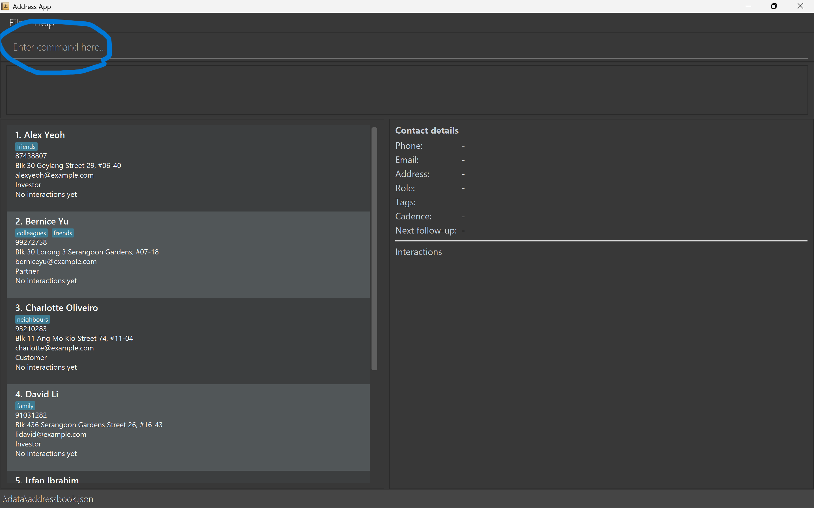
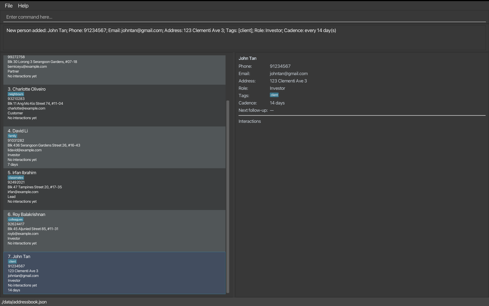
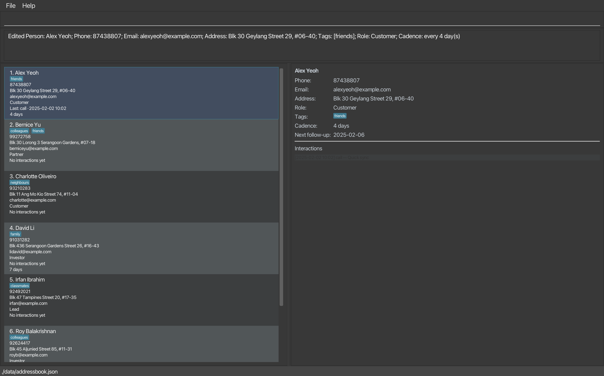
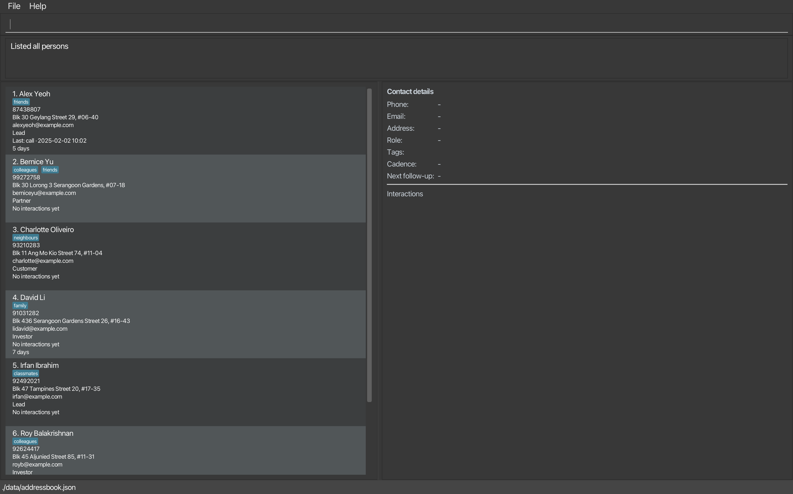
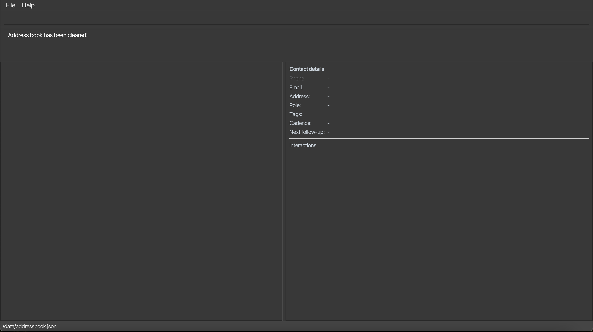

# MeshCRM User Guide

MeshCRM is made for **entrepreneurs managing customer relationships, discovery, and fundraising.**

It is a desktop app for managing contacts, optimized for use via a Command Line Interface (CLI) while still having the benefits of a Graphical User Interface (GUI).

If you type fast, often find yourself rushing to manage contacts, and want to save time, MeshCRM helps you get things done faster than traditional GUI apps.

Here’s how it helps you save time and stay on top of every relationship:

* Add and update contacts instantly. Type, hit <kbd>Enter</kbd>, and move on. No endless clicking.
* Track follow-ups effortlessly with built-in cadence and interaction logs.
* See what matters using tag-based stats and sorting by next follow-up date.
* Import and export seamlessly between CSV files.
* Work faster, not harder. The CLI gives you full control, while the GUI keeps it visual and intuitive.

MeshCRM helps entrepreneurs and teams turn scattered contacts into a structured, action-driven network.

> 💡 **Note:**  
> A **CLI (Command Line Interface)** means you type commands — like texting the app what you want it to do.  
> A **GUI (Graphical User Interface)** means you can also click buttons and see everything nicely displayed on your screen.  
> MeshCRM combines both, so you can **type fast when you want speed** and **click around when you want convenience**.

## Table of Contents
- [Quick start](#quick-start)
- [Features](#features)
- [Command Summary](#command-summary)
    - [Viewing help: help](#viewing-help--help)
    - [Adding a person: add](#adding-a-person--add)
    - [Deleting a person: delete](#deleting-a-person--delete)
    - [Editing a person: edit](#editing-a-person--edit)
    - [Listing all persons: list](#listing-all-persons--list)
    - [Locating persons by name: find](#locating-persons-by-name--find)
    - [Clearing all entries: clear](#clearing-all-entries--clear)
    - [Logging an interaction: log](#logging-an-interaction--log)
    - [Exporting contacts: export](#exporting-contacts--export)
    - [Importing contacts: import](#importing-contacts--import)
    - [Viewing tag statistics: stats](#viewing-tag-statistics--stats)
    - [Sorting persons by next follow-up date: sortfollowup](#sorting-persons-by-next-follow-up-date--sortfollowup)
    - [Command history](#command-history)
    - [Undoing latest command: undo](#undoing-latest-command--undo)
    - [Exiting the program: exit](#exiting-the-program--exit)
    - [Saving the data](#saving-the-data)
    - [Editing the data file](#editing-the-data-file)
- [FAQ](#faq)
- [Known issues](#known-issues)


--------------------------------------------------------------------------------------------------------------------

## Quick start

1. Ensure you have Java `17` or above installed in your Computer.<br>
   a. Search for Command Prompt in the Start Menu (if you are using Mac, open terminal by using Spotlight Search (Command + Space bar), then type "Terminal").
   <p align="left">
   
   </p>

   b. Type `java -version` and press Enter. You should see an output similar to below.
   
   ```
   >java version "17.0.16" 2025-07-15 LTS
   >Java(TM) SE Runtime Environment (build 17.0.16+12-LTS-247)
   >Java HotSpot(TM) 64-Bit Server VM (build 17.0.16+12-LTS-247, mixed mode, sharing)
   ```
    
   c. Verify that the terminal displays java version "17" or higher (first line in the block above).
    
   d. If Java version displayed is not Java 17 or higher:

   >**Windows users:** Ensure you have the JDK version prescribed [here](https://se-education.org/guides/tutorials/javaInstallationWindows.html).
   > 
   >**Mac users:** Ensure you have the JDK version prescribed [here](https://se-education.org/guides/tutorials/javaInstallationMac.html).

2. Download the latest `.jar` file from [here](https://github.com/AY2526S1-CS2103T-W12-3a/tp/releases).

3. Make a new folder that you want to use as the _home folder_ for your MeshCRM. Copy the `.jar` file into that folder.

4. Open the command terminal as in step 1 and change directory into the folder you put your `.jar` files in.
   <p align="left">
   
   </p>


5. Use the java -jar MeshCRM.jar command and press <kbd>Enter</kbd> to launch the application.
   <p align="left">
   
   </p>


6. A GUI similar to the below should appear in a few seconds. Note how the app contains some sample data.<br>
   <p align="left">
   
   </p>
7. Type the command in the command box (indicated by the blue circle) and press Enter to execute it. e.g. typing **`help`** and pressing Enter will open the help window.<br>
   Some example commands you can try:

* `list` : Lists all contacts.
* `add n/John Doe p/98765432 e/johnd@example.com a/John street, block 123, #01-01 t/boss r/investor c/10` : Adds a contact named `John Doe`.
* `delete 3` : Deletes the 3rd contact shown in the current list.
* `clear` : Deletes all contacts.
* `exit` : Exits the app.

6. Refer to the [Features](#features) below for details of each command.

--------------------------------------------------------------------------------------------------------------------

## Features

<div markdown="block" class="alert alert-info">

**Notes about the command format:**<br>

* Words in `UPPER_CASE` are the parameters to be supplied by the user.<br>
  e.g. in `add n/NAME`, `NAME` is a parameter which can be used as `add n/John Doe`.

* Items in square brackets are optional.<br>
  e.g `n/NAME [t/TAG]` can be used as `n/John Doe t/friend` or as `n/John Doe`.

* Items with `…`​ after them can be used multiple times including zero times.<br>
  e.g. `[t/TAG]…​` can be used as none (` `), `t/friend`, `t/friend t/family`, etc.

* Parameters can be in any order.<br>
  e.g. if the command specifies `n/NAME p/PHONE_NUMBER`, `p/PHONE_NUMBER n/NAME` is also acceptable.

* Extraneous parameters for commands that do not take in parameters (such as `help`, `list`, `exit` and `clear`) will be ignored.<br>
  e.g. if the command specifies `help 123`, it will be interpreted as `help`.

* If you are using a PDF version of this document, be careful when copying and pasting commands that span multiple lines, as space characters surrounding line breaks may be omitted when copied over to the application.
</div>

---


## Command Summary

| **Action** | **Format** | **Example** |
|-------------|-------------|--------------|
| **View Help** | `help` | — |
| **Add Contact** | `add n/NAME p/PHONE e/EMAIL a/ADDRESS [t/TAG]... r/ROLE [c/DAYS]` | `add n/John Doe p/98765432 e/johnd@example.com a/John street, block 123, #01-01 t/boss r/investor c/10` |
| **Delete Contact** | `delete INDEX` | `delete 3` |
| **Edit Contact** | `edit INDEX [n/NAME] [p/PHONE] [e/EMAIL] [a/ADDRESS] [t/TAG]... [r/ROLE] [c/DAYS]` | `edit 2 n/James Lee e/jameslee@example.com` |
| **List All Contacts** | `list` | — |
| **Find Contacts** | `find KEYWORD [MORE_KEYWORDS]` | `find James Jake` |
| **Clear All Contacts** | `clear` | — |
| **Log Interaction** | `log INDEX i/<call/email/meeting/note> d/DETAILS` | `log 1 i/meeting d/Coffee chat` |
| **Export Contacts** | `export FILE_NAME` | `export contacts.csv` |
| **Import Contacts** | `import FILE_PATH` | `import data/exports/team_oct.csv` |
| **View Tag Statistics** | `stats` | — |
| **Sort by Follow-Up Date** | `sortfollowup` | — |
| **View Command History** | *(keyboard shortcuts)* | Press <kbd>↑</kbd> / <kbd>↓</kbd> to navigate |
| **Undo Last Command** | `undo` | — |
| **Exit Program** | `exit` | — |

---

### Viewing help : `help`

Opens a new window displaying the user guide link.
The help window includes:
* A clickable link to the User Guide
* A Copy URL button to copy the user guide link

<p align="left">

</p>

---

### Adding a person : `add`

Adds a new contact to the address book. Does not allow duplicate names.

**Format:**
`add n/NAME p/PHONE e/EMAIL a/ADDRESS [t/TAG]... r/ROLE [c/DAYS]`

**Details**
* NAME, PHONE, EMAIL, ADDRESS and ROLE are mandatory.
* CADENCE and TAG are optional.
* Multiple tags can be added by repeating the t/ prefix.
* CADENCE accepts a positive number of days (e.g., c/7 means follow up every 7 days).
* ROLE should be one of the following: Investor, Partner, Customer or Lead (case-insensitive).
* NAME field with consecutive white-spaces will be reduced to 1 white-space.

**Examples:**
* add n/John Tan p/91234567 e/johntan@gmail.com a/123 Clementi Ave 3 t/client r/Investor c/14
* add n/Alicia Koh p/98765432 e/aliciakoh@yahoo.com a/88 Serangoon Road t/partner t/highvalue r/Customer c/30
* add n/Daniel Lim p/81112222 e/daniel.lim@abc.com a/25 Ang Mo Kio Ave 10 r/Lead
* add n/Sophia Lee p/90001111 e/sophia.lee@gmail.com a/18 Bishan Street 12 t/lead r/Partner c/10
* add n/Bryan Ong p/92223333 e/bryan.ong@xyz.com a/450 Jurong West St 42 t/vip t/referral r/Investor

<p align="left">

</p>
> ⚠️ **Warning:** Duplicate names are not allowed.  
> If a contact already exists with the same name, the command will be rejected.

> 💡 **Tip:** Use `c/7` or `c/14` to set regular follow-ups automatically — perfect for staying in touch with leads or clients.

---

### Deleting a person : `delete`

Deletes the specified person from the address book.

**Format:**
`delete INDEX`

* Deletes the person at the specified `INDEX`.
* Index must be a positive integer within the range of the displayed list.
* The index refers to the position shown in the displayed list.

**Examples:**
* `list` followed by `delete 2`
* `find Betsy` followed by `delete 1`

<p align="left">

</p>

---

### Editing a person : `edit`

Edits an existing contact’s details by index.

**Format:**
`edit INDEX [n/NAME] [p/PHONE] [e/EMAIL] [a/ADDRESS] [t/TAG]... [r/ROLE] [c/DAYS]`

**Details**
* Edits the person at the specified `INDEX` (must be a positive integer).
* At least one of the optional fields must be provided.
* Existing values will be updated to the input values.
* If no new value is provided for a particular field, that field will remain unchanged.
* When editing tags, existing tags will be replaced with the new ones.
* To remove all tags, type `t/` without specifying any tags after it.
* Tags are replaced, not appended. Use all desired tags in the same command.

**Examples:**
* `edit 1 p/91234567 e/johndoe@example.com`
* `edit 2 n/Betsy Crower t/`
* `edit 3 a/123 Clementi Ave 3 r/Investor`
* `edit 4 n/Alex Tan p/81234567 t/Friend t/Colleague c/14`

<p align="left">

</p>

---

### Listing all persons : `list`

Shows the full contact list.

**Format:** `list`

**Details:**

* Displays every contact in the address book.
* **Clears any active filters** from previous commands (for example, after `find`).
* The command is **recorded in command history**.
* **Abbreviation:** `l` can also be used to perform the same action.
* **Current behaviour:**
  `list` is processed even if you type extra text after it, such as `list x/1` or `list 123`.
  The additional text is **ignored** and the full list is still shown.

**Examples:**

* `list`
  Displays the complete list of contacts.
* `l`
  Displays the complete list of contacts (abbreviation).

<p align="left">

</p>

---

### Locating persons by name : `find`

Finds persons whose names contain any of the given keyword(s).

**Format:**
`find KEYWORD [MORE_KEYWORDS]`

* The search is case-insensitive.
* The order of the keywords does not matter.
* Partial matches are supported.
* Persons matching at least one keyword will be returned.

**Details:**
* The search is case-insensitive (e.g., “john” matches “John”).
* Partial matches are supported (e.g., “Nab” matches “Nabil”).
* Multiple keywords will return all persons matching any of the keywords.

**Examples:**
* `find irfan`
<p align="left">

</p>
* `find li`
<p align="left">

</p>

---

### Clearing all entries : `clear`

Clears all entries from the address book.

**Format:** `clear`

<p align="left">

</p>
---

### Logging an interaction : `log`

Adds an interaction (call / email / meeting / note) to a person’s history.

**Format:**
`log INDEX i/<call|email|meeting|note> d/<DETAILS>`

**Details:**

* Adds a new interaction record to the person at the specified `INDEX`.
* The index refers to the index number shown in the displayed person list.
* The index must be a positive integer `1, 2, 3, …`
* **Both prefixes are required:**

    * `i/` specifies the interaction type.
    * `d/` specifies the interaction details / notes.
* The interaction type in `i/` may be any of: `call`, `email`, `meeting`, `note`.
  These values are **case-insensitive** (e.g., `i/MEETING`, `i/Call` are accepted).
* `DETAILS` in `d/` **must not be empty after trimming whitespace**, and must be **500 characters or fewer**.
  (For example, `d/` *(only spaces)* or extremely long text should be rejected.)
* If the same prefix appears more than once, **the last occurrence is used**.
  For example, `log 1 i/call i/email d/Sent deck` will log an **email** interaction, not a call.
  `log 3 i/call d/A d/Left voicemail` will store **`d/Left voicemail`** as the details.
* The command is **saved in command history** (you can use <kbd>↑</kbd> and <kbd>↓</kbd> to navigate through successful
  commands later).

**Examples:**

* `log 1 i/call d/Called to confirm appointment`
  Adds a call entry with details “Called to confirm appointment” to the 1st person.
* `log 2 i/MEETING d/Project kickoff at 4pm`
  Adds a meeting entry to the 2nd person.
* `log 3 i/call d/A d/Left voicemail`
  Adds an interaction for the 3rd person with details “Left voicemail”
  *(“Left voicemail” replaces “A” because the last `d/` wins).*
* `log 1 i/call i/email d/Sent deck`
  Adds an **email** interaction for the 1st person
  *(email replaces call because the last `i/` wins).*

<p align="left">

</p>

---

### Exporting contacts : `export`

Exports the current or filtered contact list to a CSV file for use in Excel, Numbers, or Google Sheets.
(CSV-only for now. “Interactions” exports as a count, not the details.)

**Format:**
`export [FILENAME] [--profile standard|full]`

**Details:**
* Saved to data/exports/.
* .csv is added automatically if not provided.
* Prevents overwriting by adding numeric suffixes.
* Exports only the currently displayed list (respects filters).
* Columns exported (CSV): Name, Email, Address, Phone, Role, Tags, Cadence, Interactions
* In standard profile, only the subset Name, Email, Address, Phone, Role is included; in full, all columns are included.
* --profile controls how much data is included:
    * standard (default): Name, Email, Address, Phone, Role
    * Note: All of these fields must be non-empty for each exported contact.
    * full: Name, Email, Address, Phone, Role, Tags, Cadence, Interactions

**Examples:**
* `export` → timestamped CSV using standard profile
* `export team.csv` → saves as `data/exports/team.csv`
* `export submission --profile full` → exports all columns
* `export team.csv --profile standard` → exports in standard form
* `export team --profile standard` → adds .csv to the file name

<p align="left">

</p>

---

### Importing contacts : `import`

Imports contacts from a CSV file into the address book.  
Duplicate entries (based on `Person#equals`) are skipped automatically.

**Format:**
`import FILE_PATH`

**Details:**
* Reads data from a CSV at the given path (relative or absolute).
* Required columns (case-insensitive): Name, Email, Address, Phone, Role
* Optional columns: Tags, Cadence, Interactions (Interactions are not imported for now; the column is ignored.)
* Accepts comma, semicolon, or tab delimiters.
* Unknown or missing columns are ignored.
* Malformed rows (e.g., missing any required field) are skipped safely.
* Duplicates (same person per Person#equals) are skipped.

**Examples:**
* `import data/exports/contacts_backup.csv`
* `import ./data/exports/team_oct.csv`
* `import /Users/me/Downloads/mesh_contacts.csv`


**Notes**
* If the file path is empty or the file doesn’t exist, the command fails.
* If the CSV has no valid contacts after skipping malformed/duplicate rows, the command fails with a message indicating no valid contacts were found.
* Header names are case-insensitive and column order doesn’t matter.

<p align="left">

</p>
---

### Viewing tag statistics : `stats`

Displays a summary of how many contacts belong to each tag in the address book.

**Format:**  
`stats`

**Details:**
* Counts how many contacts are associated with each tag.
* Tags are shown in **descending order of frequency**, then alphabetically if counts are equal.
* If no tags exist, shows: `No tags found on any contact.`
* Useful for understanding your contact composition (e.g., how many clients, investors, or friends you have).

<p align="left">

</p>

---

### Sorting persons by next follow-up date : `sortfollowup`

Sorts all persons in the address book by their next follow-up date.
Calculated from their last interaction date and cadence (in days).

**Format:** `sortfollowup`

This command helps you prioritise which contacts to reach out to next.
* The next contact date = last interaction date + cadence days.
* Contacts with earlier next contact dates appear first.
* Contacts with no cadence and/or no recorded interactions appear last.
* Sorting affects only the displayed list — your data remains unchanged.
* Useful for tracking regular check-ins or follow-ups with clients.

> 💡 **Tip:** Use `sortfollowup` after logging new interactions to quickly see who you’ve recently contacted. </div>
 
<p align="left">

</p>

---

### Command history

All commands made previously are stored, able to toggle to previous commands

**Format:**
Press <kbd>↑</kbd> and <kbd>↓</kbd> to navigate command history.

**Details:**
* Shown in chronological order (most recent last).
* Persists through different sessions
* Invalid commands are not recorded
* Navigate directly using keyboard:
    * <kbd>↑</kbd> — previous command
    * <kbd>↓</kbd> — next command

---

### Undoing latest command : `undo`

Undoes the most recent command made

**Format:**
`undo`

**Details:**
* Undo is recorded in the command history
* Undoing a command does not remove it from the command history

---

### Exiting the program : `exit`

**Format:** `exit`

**Details:**

* Exits the program and closes all windows.
* Your data is **saved automatically before the program quits**, so you do not need to manually save first.
* The command is **recorded in command history**.
* **Abbreviation:** `x` can also be used.

**Examples:**

* `exit`
  Exits the program after saving.
* `x`
  Exits the program after saving (abbreviation).

---

### Saving the data

MeshCRM data are saved automatically to the hard disk after every command that changes the data.

---

### Editing the data file

Data are stored as a JSON file: `[JAR file location]/data/addressbook.json`.

> ⚠️ **Warning:** If the file format becomes invalid, MeshCRM will start with an empty data file on the next run. Always back up before editing manually.

--------------------------------------------------------------------------------------------------------------------

## FAQ

### ❓ How do I transfer my data to another computer?
Install MeshCRM on the new computer and replace its empty data file with the one from your old MeshCRM home folder.

### ❓ My contacts didn’t save after I added them. What should I do?
Make sure MeshCRM is saved in a folder you can edit, such as `Documents` or `Desktop`.  
If it’s in a protected system folder, the app might not be able to save new data.

### ❓ I imported a CSV file, but not all contacts appeared. Why?
Some rows might be skipped if they are incomplete or repeated.  
Check that each row has a **name, phone number, email, and address**.

### ❓ How do I start fresh with new sample data?
Delete or rename the `addressbook.json` file in the `data` folder, then restart MeshCRM.  
It will automatically create a new one with sample contacts.

### ❓ Contacts with the same name disallowed. What if I want to add 2 contacts with identical names?
In the event that the user wishes to add 2 people to the contact list with the same name but are unable to, 
they can their full names instead to distinguish between them.

--------------------------------------------------------------------------------------------------------------------

## Known issues

1. **Multiple screens:** The GUI may open off-screen if the app was last closed on a secondary display. Delete `preferences.json` to reset window position.
2. **Minimized Help Window:** If minimized, re-running `help` will not open a new window. Restore the existing one manually.
3. **Undo refreshes details panel:** Entering undo while viewing a details panel will cause the details panel to default to the empty details panel. The user will have to click on the person to review his/her details.

--------------------------------------------------------------------------------------------------------------------

